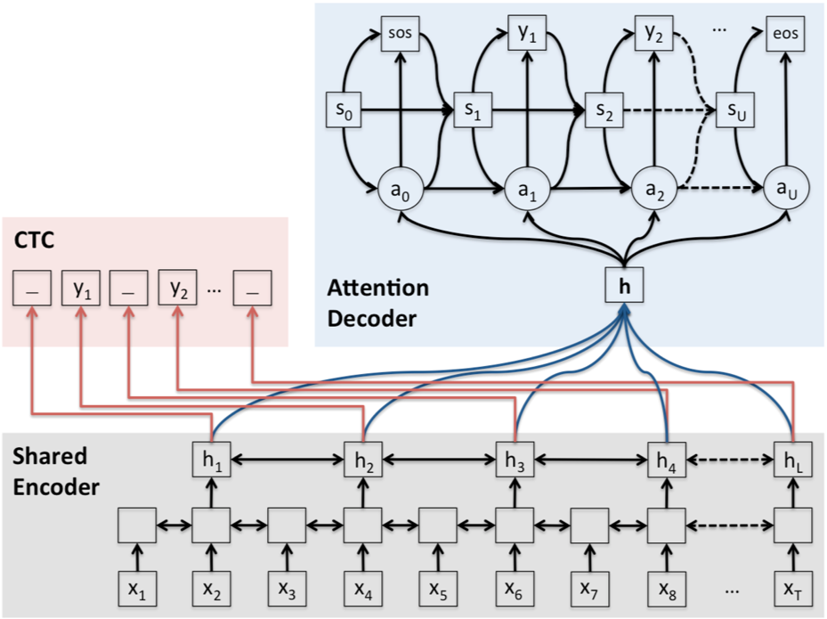
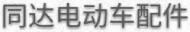
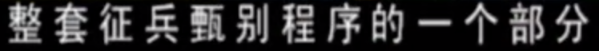
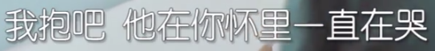
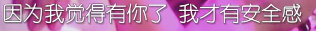
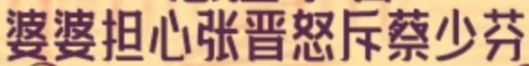
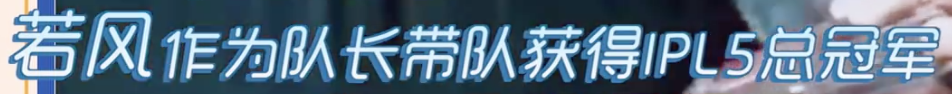
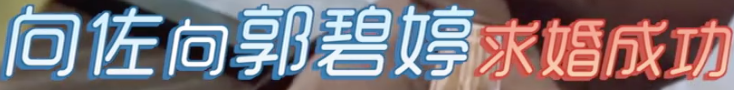
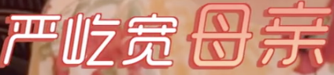

# mtl-text-recognition
multi-task learning for text recognition with joint ctc-attention.
## Update features
+ support **variable** length of squence training and inference (fixed height).
+ **Chinese** character recognition.
+ **Joint CTC-Attention**<br><br>
 <br><br>
## Getting Started
### Dependency
- This work was tested with PyTorch 1.1.0, CUDA 9.0, python 3.6 and centos7 
- requirements : pytorch, lmdb, pillow, torchvision, nltk, natsort
```
pip3 install torch==1.1.0
pip3 install lmdb pillow torchvision nltk natsort
```
### Run demo with pretrained model(中文+英文字符版本，使用config中的chn.txt文件)
1. Download pretrained model(crnn) from [baidu](https://pan.baidu.com/s/1tsqdunmZQV17ckqllP4YJw) code:un8d<br>
pretrained crnn model configuration:
```
--output_channel 512 \
--hidden_size 256 \
--Transformation None \
--FeatureExtraction ResNet \
--SequenceModeling BiLSTM \
--Prediction CTC 
```
run demo with pretrained mdoel.
```
# change config.py file and run:
CUDA_VISIBLE_DEVICES=0 python3 infer.py ${image_path}
```
2. CTC-Attention pretrained model will release later.
## prediction results
| demo images | [None-ResNet512-BiLSTM256-CTC](https://pan.baidu.com/s/1tsqdunmZQV17ckqllP4YJw) | None-ResNet768-BiLSTM384-CTC |
|     ---      |     ---      |     ---      |
    |   同达电动车配件   |  同达电动车配件   |
|     |   微信14987227   |   微信14987227  |
|       |   快乐大本营20190629期:张艺兴李荣浩惊喜同台合唱彭昱畅破音三连引     |   快乐大本营20190629期:张艺兴李荣浩惊喜同台合唱彭昱畅破音三连引    |
|   |   每周三中午12:00   |  每周三中午12-00   |
|       |   整套征兵甄别程序的一个部分     |   整套征兵甄别程序的一个部分    |
|     |   再热烈的鼓掌   |  再热烈的鼓掌   |
|       |   厂外恒升拆车件     |   广州恒升拆车件    |
|     |   我想说你为什么   |  我想说你为什么   |
|       |    我抱吧他在你怀里一直在哭    |   我抱吧他在你怀里一直在哭    |
|     |   如果没有这个阿姨的话   |  如果没有这个阿姨的话   |
|       |    因为我觉得有你了我才有安全感    |   因为我觉得有你了我才有安全感    |
|       |   丫OUI<U     |   YOUKU    |
|   |   麦油娜孕其智商下线   |   轰迪娜马期智商下线  |
|       |   因为后一仁看《《二》的巡演     |   团为册长加看飞广海》的巡演    |
|     |   铂爵   |  铂爵   |
|       |   婆婆担心张晋怒斥蔡少芬     |   婆婆担心张晋怒斥蔡少芬    |
|     |   若风作为队长带队获得/PL5总冠军   |   若风作为队长带队获得/PL5总冠军  |
|       |    向佐向郭碧婷求婚戊功    |   向佐向郭碧婷求婚成功    |
|     |   严屹宽骨亲   |  严屹宽母宗   |
|       |    哇品会    |   唯品会    |
|       |    YOUI<U独播    |   YOUKU独播    |

### Training and evaluation
1. Train CRNN model
```
CUDA_VISIBLE_DEVICES=0 python train.py \
	--train_data data/synch/lmdb_train \
	--valid_data data/synch/lmdb_val \
	--select_data / --batch_ratio 1 \
	--sensitive \
  	--num_iter 400000 \
  	--output_channel 512 \
  	--hidden_size 256 \
	--Transformation None \
  	--FeatureExtraction ResNet \
  	--SequenceModeling BiLSTM \
  	--Prediction CTC \
  	--experiment_name none_resnet_bilstm_ctc \
  	--continue_model saved_models/pretrained_model.pth
```
2. Train CTC-Attention model
```
CUDA_VISIBLE_DEVICES=0 python train.py \
	--train_data data/synch/lmdb_train \
	--valid_data data/synch/lmdb_val \
	--select_data / --batch_ratio 1 \
  	--sensitive \
  	--num_iter 400000 \
  	--output_channel 512 \
	--hidden_size 256 \
	--Transformation None \
  	--FeatureExtraction ResNet \
  	--SequenceModeling BiLSTM \
  	--Prediction CTC \
  	--mtl \
  	--without_prediction \
  	--experiment_name none_resnet_bilstm_ctc \
  	--continue_model saved_models/pretrained_model.pth
```

## Acknowledgements
1. This implementation has mainly been based on this great repository: [deep-text-recognition-benchmark](https://github.com/clovaai/deep-text-recognition-benchmark)
2. SynthText Generation has mainly been based on [TextRecognitionDataGenerator](https://github.com/Belval/TextRecognitionDataGenerator/tree/master/TextRecognitionDataGenerator)
